# Pied Poker
## By Ellek Linton
#### [View As Colab Notebook](https://colab.research.google.com/drive/1sLgDZRGmRojkJUEcHwz9o1j9ZN2j4l0p?usp=sharing)

Hi! My name is Ellek, and I studied data science at UC Berkeley. I started getting into Poker during the pandemic, and wanted to create a better way to calculate poker probabilities using code.

I wrote this Python library to generate **any** poker probability on the fly and calculate your exact odds of hitting the hand you are targeting. For example, say you have AK suited, and the flop comes out 4AK. What are your odds of hitting a full house? What about the probability that, against 5 other players at this table, you win the hand? Well, you can calculate each of these probabilities, and nearly any other probability you want with this code!

This notebook serves as an example of how to use my `pied_poker` Python package to simulate poker games and probabilities. This Python package has been thoroughly unit tested and functionally tested.

This project is 100% self-written, 100% open source, and 100% free to use (excluding commercial use). For more info on the package, see the [Github Project](https://github.com/elleklinton/PiedPoker).

Let's dive right in!

First, we need to install and import the `pied_poker` package:


```python
%pip install pied_poker==1.2.3

import pied_poker as pp
import numpy as np
np.random.seed(420)
```

    Requirement already satisfied: pied_poker==1.2.3 in /usr/local/lib/python3.10/dist-packages (1.2.3)
    Requirement already satisfied: joblib in /usr/local/lib/python3.10/dist-packages (from pied_poker==1.2.3) (1.3.2)
    Requirement already satisfied: tqdm in /usr/local/lib/python3.10/dist-packages (from pied_poker==1.2.3) (4.66.1)
    Requirement already satisfied: numpy in /usr/local/lib/python3.10/dist-packages (from pied_poker==1.2.3) (1.23.5)
    Requirement already satisfied: seaborn in /usr/local/lib/python3.10/dist-packages (from pied_poker==1.2.3) (0.12.2)
    Requirement already satisfied: pandas in /usr/local/lib/python3.10/dist-packages (from pied_poker==1.2.3) (1.5.3)
    Requirement already satisfied: matplotlib in /usr/local/lib/python3.10/dist-packages (from pied_poker==1.2.3) (3.7.1)
    Requirement already satisfied: contourpy>=1.0.1 in /usr/local/lib/python3.10/dist-packages (from matplotlib->pied_poker==1.2.3) (1.2.0)
    Requirement already satisfied: cycler>=0.10 in /usr/local/lib/python3.10/dist-packages (from matplotlib->pied_poker==1.2.3) (0.12.1)
    Requirement already satisfied: fonttools>=4.22.0 in /usr/local/lib/python3.10/dist-packages (from matplotlib->pied_poker==1.2.3) (4.46.0)
    Requirement already satisfied: kiwisolver>=1.0.1 in /usr/local/lib/python3.10/dist-packages (from matplotlib->pied_poker==1.2.3) (1.4.5)
    Requirement already satisfied: packaging>=20.0 in /usr/local/lib/python3.10/dist-packages (from matplotlib->pied_poker==1.2.3) (23.2)
    Requirement already satisfied: pillow>=6.2.0 in /usr/local/lib/python3.10/dist-packages (from matplotlib->pied_poker==1.2.3) (9.4.0)
    Requirement already satisfied: pyparsing>=2.3.1 in /usr/local/lib/python3.10/dist-packages (from matplotlib->pied_poker==1.2.3) (3.1.1)
    Requirement already satisfied: python-dateutil>=2.7 in /usr/local/lib/python3.10/dist-packages (from matplotlib->pied_poker==1.2.3) (2.8.2)
    Requirement already satisfied: pytz>=2020.1 in /usr/local/lib/python3.10/dist-packages (from pandas->pied_poker==1.2.3) (2023.3.post1)
    Requirement already satisfied: six>=1.5 in /usr/local/lib/python3.10/dist-packages (from python-dateutil>=2.7->matplotlib->pied_poker==1.2.3) (1.16.0)


Recently, I started playing bar poker. Initially, poker seemed like a simple game of chance—you might lose, you might win, or you might even tie. But as I played more, I realized there’s a lot more to poker beneath the surface. In every poker round, there is an element of risk, human psychology, and inherent randomness. These factors can seem dynamic and unpredictable, but a good poker player is able to effectively weigh them all to beat their opponent. I wanted to reach this level of intuition; one where I felt comfortable and confident in my betting decisions, so I made `pied_poker`!

The `pied_poker` Python package is a pure Python library to simulate poker games and probabilities efficiently. It uses an optimized Monte-Carlo style simulation.

## Introduction: A Simple Example

Imagine you are starting a round of poker and you are dealt the Ace of Spades and the Queen of Spades.


```python
p1 = pp.Player('Ellek', pp.Card.of('as', 'qs'))
p2 = pp.Player('Opponent') # We don't know the opponent's cards, so we leave that empty
print(p1, p2)
```

    Ellek: [A♠, Q♠] Opponent: []


You bet the minimum $5 to play your hand that round because it seems like a good starting hand.

The first 3 table cards are turned: 4 of Spades, 4 of Hearts, and the 10 of Spades.


```python
community_cards = pp.Card.of('4s', '4h', '10s')
print(f'Community cards: {community_cards}')
```

    Community cards: [4♠, 4♥, 10♠]


Let's put this information into a "Game State", or `PokerRoundResult` in the `pied_poker` package:


```python
round_result = pp.PokerRound.PokerRoundResult([p1, p2], community_cards)
round_result
```


    Community Cards: [4♠, 4♥, 10♠]
    
         *Ellek* (winner):
              Cards: [A♠, Q♠]
              Hand: OnePair([4♠, 4♥], [A♠, Q♠, 10♠])
    
         Opponent:
              Cards: []
              Hand: OnePair([4♠, 4♥], [10♠])


What "outs" do we have here? We can calculate that!


```python
round_result.outs(p1)
```


    [Out(Flush, [2♠, 3♠, 5♠, 6♠, 7♠, 8♠, 9♠, J♠, K♠]),
     Out(TwoPair, [A♣, A♦, A♥, Q♣, Q♦, Q♥])]


We have Flush outs, if any of those Spades show up. We also have TwoPair outs, if either an A or Q shows up.

On the flipside, which possible cards could our *opponents* have that would beat our current hand? In `pied_poker`, these are called `killer_cards`. We can calculate those:


```python
round_result.killer_cards(p2)
```


    [KillerCard(ThreeOfAKind, [4♣, 4♦]), KillerCard(TwoPair, [10♣, 10♦, 10♥])]


As you can see, if our opponent has a 4, they would make ThreeOfAKind, which would beat our current hand. They could also have a 10, which would give them TwoPair, which also beats our current hand.

Let's keep going with the game! The fourth card turns, it’s the King of Spades:


```python
community_cards.append(pp.Card('ks'))
print(f'Ellek\'s cards: {p1.cards}')
print(f'Community cards: {community_cards}')
```

    Ellek's cards: [A♠, Q♠]
    Community cards: [4♠, 4♥, 10♠, K♠]


We can once again calculate the Outs and Killer Cards for our player below to see how this card has changed things!


```python
round_result = pp.PokerRound.PokerRoundResult([p1, p2], community_cards)
round_result
```


    Community Cards: [4♠, 4♥, 10♠, K♠]
    
         *Ellek* (winner):
              Cards: [A♠, Q♠]
              Hand: Flush([A♠, K♠, Q♠, 10♠, 4♠], [])
    
         Opponent:
              Cards: []
              Hand: OnePair([4♠, 4♥], [K♠, 10♠])


```python
round_result.outs(p1, False) # The "False" here indicates that we don't want to return "Outs" that are the same hand class (higher flushes)
```


    [Out(RoyalFlush, [J♠])]


As we can see, we have hit our flush!!! We have the best possible hand on the board now! We hit the nuts. As such, we have no killer cards remaining on the current board.

However, since we have hit our beautiful nut flush, we now have the added exciting RoyalFlush draw, if the Jack of Spades shows up!

Finally, the last card turns: it’s the 10 of Hearts:


```python
community_cards.append(pp.Card('10h'))
print(f'Community cards: {community_cards}')
```

    Community cards: [4♠, 4♥, 10♠, K♠, 10♥]


So in summary, your cards are [A♠, Q♠], and the table cards are [4♠, 4♥, 10♠, K♠, 10♥]. Let's create one round result:


```python
round_result = pp.PokerRound.PokerRoundResult([p1, p2], community_cards)
round_result
```


    Community Cards: [4♠, 4♥, 10♠, K♠, 10♥]
    
         *Ellek* (winner):
              Cards: [A♠, Q♠]
              Hand: Flush([A♠, K♠, Q♠, 10♠, 4♠], [])
    
         Opponent:
              Cards: []
              Hand: TwoPair([10♠, 10♥, 4♠, 4♥], [K♠])


We still have a *pretty* good hand, but what cards could our opponent have that would beat us? We can calculate this again with killer cards:


```python
round_result.killer_cards(p1)
```


    [KillerCard(FullHouse, [10♣, 10♦, 4♣, 4♦])]


As we expect, it's now possible for our opponent to have a FullHouse which would beat our Flush, if they have either a 4 or a 10.

Your opponent raises the bet to $30, and you must decide if you want to call his bet, or fold and lose the money you’ve already contributed to the pot. If your opponent has either a 4 or a 10, they would have a Full House that would beat your Ace-high Flush. Or, they could have a worse hand than you, maybe a King-high Flush. What would you do in this situation—would you call your opponent’s raise, hoping your Flush sustains the win? Or would you fold out of fear that your opponent has the Full House?

Using the `pied_poker` Python package, we can calculate all of these odds!

First, lets run some simulations. Lets use this scenario and simulate it 10,000 times to see the different possible outcomes.


```python
simulator = pp.PokerRound.PokerRoundSimulator(community_cards=community_cards,
                       players=[p1, p2],
                      total_players=2)
num_simulations = 10000

simulation_result = simulator.simulate(n=num_simulations, n_jobs=1)
```

    100%|██████████| 10000/10000 [00:10<00:00, 971.67it/s]


Now that we have run the simulation, we can calculate any probability we want! First, let's visualize the hand type distribution for you (p1) in this setup:


```python
simulation_result.visualize_player_hand_distribution(p1)
```


    
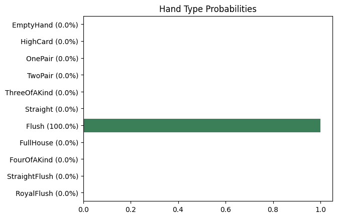
    


Since all of the community cards are dealt, and we know what cards you have, there will be zero variation in the hand you end up with -- you will always end up with a Flush.

However, for your opponent, we don't know their cards, so there will be some variation!

Let's see what hands your opponent is likely to have in this simulation:


```python
simulation_result.visualize_player_hand_distribution(p2)
```


    
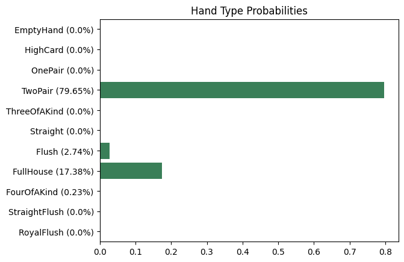
    


Your opponent is most likely to have TwoPair here, because the table cards already have Two Pair. However, a Full House is fairly likely, because your opponent only needs a 4 or a 10 to get a Full House.

Let's shift the gears a bit and calculate the probability that you would win with this setup:


```python
simulation_result.probability_of(pp.Probability.PlayerWins(p1))
```


    82.39% == 4.68:1 odds == (8239/10000)


So, you have roughly an 82% chance of winning, or 5:1 odds -- pretty good odds!

We can take a peek at one of the simulations where you won:


```python
simulation_result.where(pp.Probability.PlayerWins(p1)).sample()
```


    Community Cards: [4♠, 4♥, 10♠, K♠, 10♥]
    
         *Ellek* (winner):
              Cards: [A♠, Q♠]
              Hand: Flush([A♠, K♠, Q♠, 10♠, 4♠], [])
    
         Opponent:
              Cards: [6♣, 8♥]
              Hand: TwoPair([10♠, 10♥, 4♠, 4♥], [K♠])


In this specific simulation, your opponent had the cards [6♣, 8♥], giving them 2 pair, which was of course beaten by your Ace-high flush.

Now, lets look at an example where you lost to your opponent:


```python
simulation_result.where(pp.Probability.PlayerLoses(p1)).sample()
```


    Community Cards: [4♠, 4♥, 10♠, K♠, 10♥]
    
         *Opponent* (winner):
              Cards: [10♣, Q♥]
              Hand: FullHouse([10♣, 10♠, 10♥, 4♠, 4♥], [])
    
         Ellek:
              Cards: [A♠, Q♠]
              Hand: Flush([A♠, K♠, Q♠, 10♠, 4♠], [])


In this specific simulation, your opponent had the cards [10♣, Q♥], giving them a Full House, which would beat your flush.

Now, lets calculate the probability that your opponent has specifically a Full House:


```python
simulation_result.probability_of(pp.Probability.PlayerHasHand(pp.Hand.FullHouse, p2))
```


    17.38% == 1:4.75 odds == (1738/10000)


There's roughly a 17% chance that your opponent has a 4 or a 10, which would give them a Full House, beating your Ace-high flush.

## Probability of Different Poker Hands

Lets calculate and visualize the base hand distribution probability before any cards are dealt.

### 2 Player Game Hand Probabilities
First, let's consider a 2 player poker game and analyze which hands you are likely to get:


```python
simulator = pp.PokerRound.PokerRoundSimulator(total_players=2)
num_simulations = 10000

simulation_result = simulator.simulate(n=num_simulations, n_jobs=1)
simulation_result.visualize_player_hand_distribution()
```

    100%|██████████| 10000/10000 [00:25<00:00, 394.30it/s]


    

    


As we can see from the graph above, One Pair is by far the most likely poker Hand to get. Surprisingly, One Pair and Two Pair are actually both more likely than High Card, and a straight is ever so slightly more likely than three of a kind!

We can also visualize the distribution of winning hands before any cards are dealt for 2 players. This graph basically shows us, for all of the winning hands, how they are distributed.

Essentially, this is how likely each hand is to be a winning hand:


```python
simulation_result.visualize_winning_hands(cumulative=False)
```


    
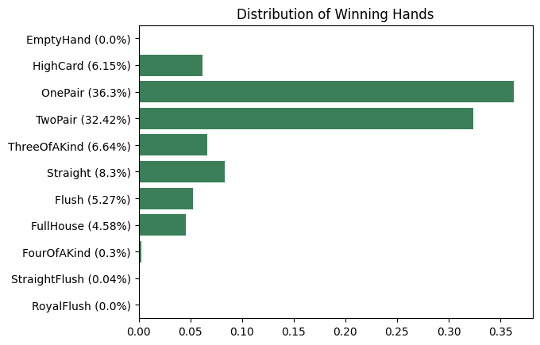
    


This means that for a 2 player game, 6% of the time, a High Card is the winning hand, 36% of the time One Pair is the winning hand, etc.

We can also calculate the *cumulative* winning hand probabilities, which is equivalent to the probability that, given that you have the hand below, the probability that the respective hand would win in this simulation (assuming all players stay in). Essentially the probabiltiy that you have the best hand at the table:


```python
simulation_result.visualize_winning_hands(cumulative=True)
```


    
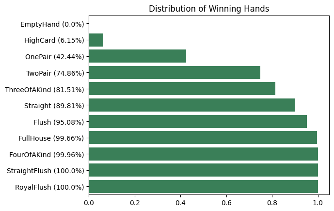
    


According to this graph, in a 2 player game, One Pair will win 42% of the time, Two Pair will win 74% of the time, Three of a Kind will win 81% of the time, etc

### 9 Player Game Hand Probabilities

Similarly, we can calculate the winning hand distribution for a game of 9 players. We begin by first running the simulation.

After the simulation runs, let's analyze the hand distribution you are likely to get in a 9 player game:


```python
simulator = pp.PokerRound.PokerRoundSimulator(total_players=9)
num_simulations = 10000

simulation_result = simulator.simulate(n=num_simulations, n_jobs=1)
simulation_result.visualize_player_hand_distribution()
```

    100%|██████████| 10000/10000 [00:50<00:00, 199.99it/s]


    
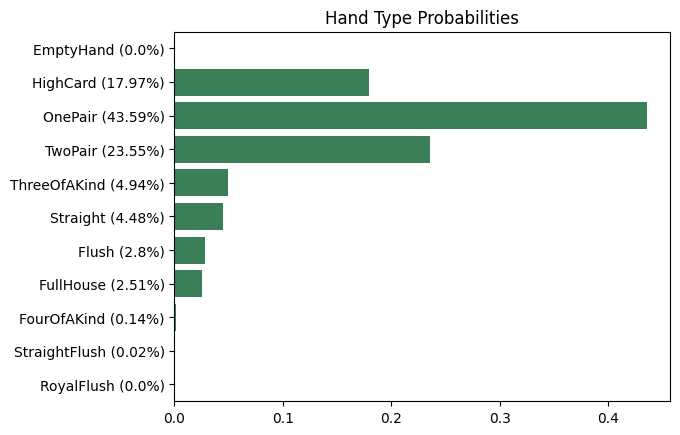
    


As we can see from the graph above, the distribution of each hand type is the same regardless of how many players at the table. This is because, for example, you are equally likely to get Three of a Kind on a table of 2 players vs a table of 9 players.

However, the winning hand probabilities will be different depending on the number of players at the table. For example, Three of a Kind is less likely to win at a table of 9 players vs a table of 2 players:


```python
simulation_result.visualize_winning_hands(cumulative=False)
```


    
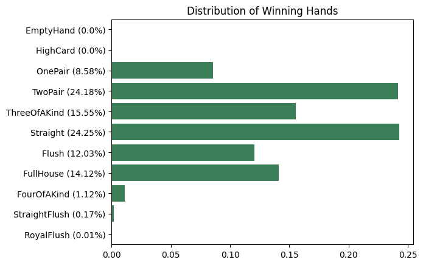
    


Similarly, we can also calculate the *cumulative* winning hand probabilities, which is equivalent to the probability that, given that you have the hand below, the probability that the respective hand would win in this simulation (assuming all players stay in). Essentially the probabiltiy that you have the best hand at the table:


```python
simulation_result.visualize_winning_hands(cumulative=True)
```


    
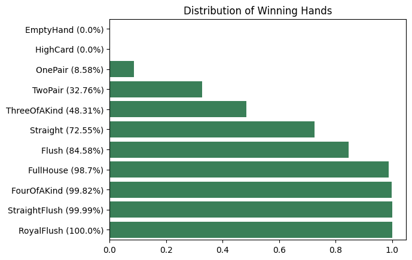
    


This says that, in a game of 9 players, One Pair will win 8.9% of the time, Two Pair will win 31% of the time, Three of a Kind will win 46% of the time, etc.

## Analyzing Pocket Aces

One of the most notorious starting hands in poker is pocket Aces. But how good of a hand is this really? Lets find out! As we will come to learn, the strength of this hand depends heavily on how many players are at the table.

If you have a lot of players, say 9 players, the liklihood that someone will have a better hand than you after the table cards are drawn is pretty high. But if you are only playing against 1 other player, odds are your pocket Aces will hold up. Lets dive in!

First, lets initialize our player, who was dealt pocket Aces:


```python
p1 = pp.Player('Ellek', pp.Card.of('as', 'ac'))
p1
```


    Ellek: [A♠, A♣]


### Pocket Aces with 2 Players

Let's first assume there are only 2 players to keep it simple, and let's run 10,000 simulations on this scenario:


```python
simulator = pp.PokerRound.PokerRoundSimulator(community_cards=[],
                       players=[p1],
                      total_players=2)
num_simulations = 10000

simulation_result = simulator.simulate(n=num_simulations, n_jobs=1)
```

    100%|██████████| 10000/10000 [00:04<00:00, 2095.01it/s]


First, lets just look at the probability that you win with pocket Aces in a game of 2 players:


```python
simulation_result.probability_of(pp.Probability.PlayerWins())
```


    85.47% == 5.88:1 odds == (8547/10000)


You've got about an 85% chance of winning the pot (when 2 players) with pocket Aces -- not bad!

##### What Hands Are Likely With Pocket Aces?

We can also analyze the different possible hands that you could end up with when you have pocket Aces. Lets visualize the distribution of the hand types that were observed in this simulation:


```python
simulation_result.visualize_player_hand_distribution(p1)
```


    
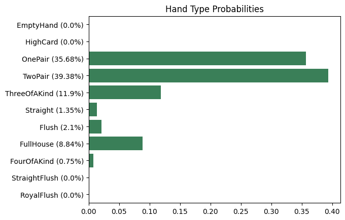
    


From this graph, we can see that the most likely hand to get with pocket Aces is Two Pair, followed by One Pair. Three of a Kind or Full House are also fairly likely, but not nearly as likely as One Pair or Two Pair.

### Pocket Aces with 9 Players

Now that we have explored the probabilities for pocket Aces with 2 players, lets run the same simulation, but this time with *9 players* and see how the probabilities change!


```python
simulator = pp.PokerRound.PokerRoundSimulator(community_cards=[],
                       players=[p1],
                      total_players=9)
num_simulations = 10000

simulation_result = simulator.simulate(n=num_simulations, n_jobs=1)
simulation_result
```

    100%|██████████| 10000/10000 [00:31<00:00, 322.56it/s]


    <pied_poker.poker_round.poker_round_simulation_result.PokerRoundSimulationResult at 0x79499fde1d80>


Remember, with only 2 players, you have an 86% chance of winning with pocket Aces. Now, let's examine the probability that you win with pocket Aces with ***9 players***:


```python
simulation_result.probability_of(pp.Probability.PlayerWins())
```


    35.5% == 1:1.82 odds == (3550/10000)


As expected, the probability that you win with pocket aces with 9 players is significantly less than with 2 players.

When there are 2 players, you have an 86% chance of winning with pocket Aces. But with 9 players, you only have a 35% chance of winning.

##### What Hands Are Likely With Pocket Aces?

Now, let's also analyze the distribution of the hand types that were observed in this simulation:


```python
simulation_result.visualize_player_hand_distribution(p1)
```


    
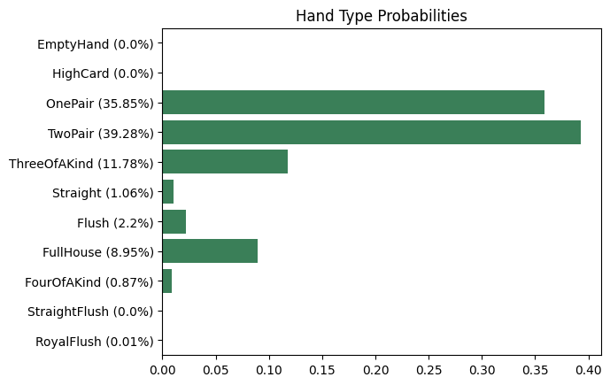
    


If you compare this with the hand distribution chart for only 2 players, you will notice they are identical! How can that be possible yet we still have a lower chance of winning with 9 players?

This happens because when you only have 2 players, it's much less likely that your opponent has a hand better than yours. But when you have 9 players, it's more likely that someone else will end up with a stronger hand than you since there are simply more players and hence more possible hands.

For example, a common outcome for pocket Aces is Three of a Kind. If you only have 2 players, the odds that your opponent has a hand better than Three of a Kind is lower. But if you have 9 players at a table, the odds that *someone* will have a higher hand than Three of a Kind is significantly higher. In essence, the more players you have, the higher chance someone has a better hand than you, and the lower the strength of your given hand.

## Analyzing Real World Examples
Lets apply this to some real poker examples.

### Example 1


In this example, we have 3 players:
- Tom already has a Straight `(A 2 3 4 5)`
- Masa has Three of a Kind 8s `(8 8 8)`
 - If another 8 shows up, Masa will have Four of a Kind
 - Or if an A, 2, or 4 shows up, Masa would have a Full House
- Andrew has nothing yet, but if one more Heart card shows up, he will have a Flush.

This is a dirty board.


Lets dive into the probabilities! First, we need to run a simulation of this scenario:


```python
tom = pp.Player('Tom', pp.Card.of('3c', '5d'))
masa = pp.Player('Masa', pp.Card.of('8c', '8s'))
andrew = pp.Player('Andrew', pp.Card.of('10h', '9h'))
community_cards = pp.Card.of('4c', '8h', 'ah', '2s')

round_simulator = pp.PokerRound.PokerRoundSimulator(community_cards, [tom, masa, andrew], 3)
simulation_result = round_simulator.simulate(10000, n_jobs=1)
```

    100%|██████████| 10000/10000 [00:13<00:00, 720.56it/s]


Now that the simulation has been run, we can visualize the liklihood of each player winning:


```python
simulation_result.visualize_winner_distribution()
```


    
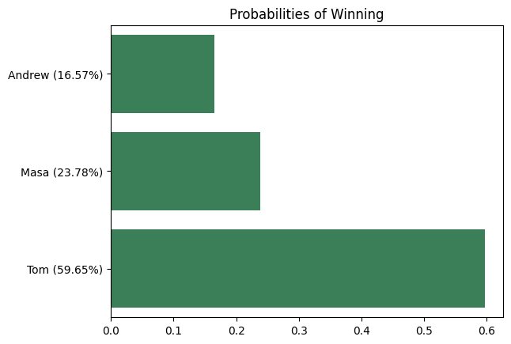
    


Let's look at the hand distribution for Tom, who had [3♣, 5♦], and already has a Straight on the board:


```python
simulation_result.visualize_player_hand_distribution(tom)
```


    

    


Since Tom already has a Straight, and there's not any other better hand he could get here, he will always have a Straight.

Let's now look at the hand distribution for Masa, who had [8♣, 8♠], and already has Three of a Kind 8s on the board:


```python
simulation_result.visualize_player_hand_distribution(masa)
```


    
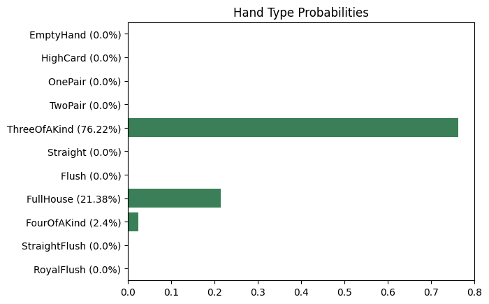
    


The most likely result for Masa is to maintain his Three of a Kind 8s, however, there's also the possibility for him to get a Full House or Four of a Kind.

Finally, let's look at the hand distribution of Andrew, who has the cards [10♥, 9♥], and is one card away from a Flush:


```python
simulation_result.visualize_player_hand_distribution(andrew)
```


    

    


Of course, Andrew is likely betting that he will hit his Flush here, which we now know is roughly a 21% chance.

### Example 2


In this example, we again have 3 players:
- Kallakis has [9♠, 5♠], and there are 3 Spades on the table, so has a 9-high flush.
 - If the 4 of Spades or the 8 of Spades shows up, Kallakis will have a Straight Flush, virtually guaranteeing him the win
- Flanders has [5♦, 4♣], giving him a Straight `(3 4 5 6 7)`
- Odea has Three of a Kind 3s
 - If another 3 shows up, Odea would have Four of a Kind
 - If a 6, 7, or K shows up, Odea would have a Full House


Lets dive into the probabilities! First, we need to run a simulation of this scenario:


```python
kallakis = pp.Player('Kallakis', pp.Card.of('9s', '5s'))
flanders = pp.Player('Flanders', pp.Card.of('5d', '4c'))
odea = pp.Player('Odea', pp.Card.of('3h', '3d'))
community_cards = pp.Card.of('6s', '7s', '3s', 'kh')

round_simulator = pp.PokerRound.PokerRoundSimulator(community_cards, [kallakis, flanders, odea], 3)
simulation_result = round_simulator.simulate(10000, n_jobs=1)
```

    100%|██████████| 10000/10000 [00:08<00:00, 1162.21it/s]


Now that the simulation has been run, we can visualize the liklihood of each player winning:


```python
simulation_result.visualize_winner_distribution()
```


    
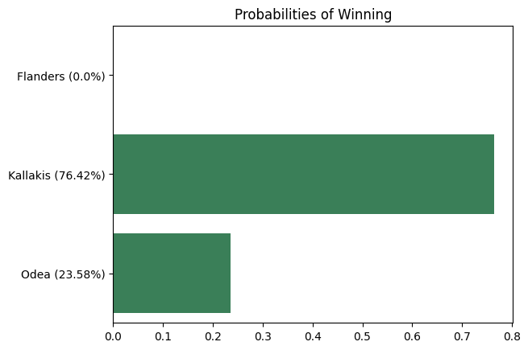
    


Kallakis is the most likely to win, since he already has a Flush. However, Odea also has a chance of winning if he gets a Full House or Four of a Kind.

Let's look at the hand distribution for Kallakis ([9♠, 5♠]), who already has a Flush, with the possibility for a Straight Flush:


```python
simulation_result.visualize_player_hand_distribution(kallakis)
```


    
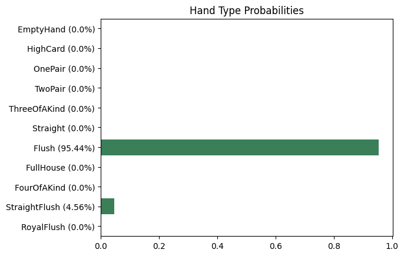
    


The most likely outcome is that Kallakis holds his Flush (95%), with about a 5% chance of hitting the Straight Flush.

Now, let's look at the hand distribution for Flanders, who already has a Straight with his pocket cards of [5♦, 4♣]:


```python
simulation_result.visualize_player_hand_distribution(flanders)
```


    
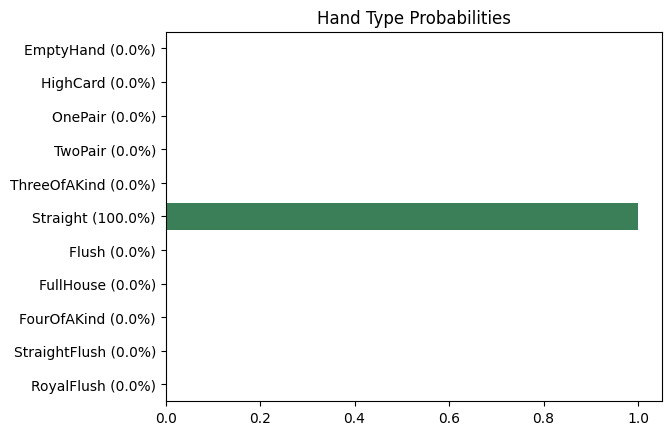
    


Since regardless of the next card, it's impossible for Flanders to get anything higher than a Straight, the only possible hand he could have is Straight.

Finally, let's look at the hand distribution for Odea, who had pocket 3s [3♥, 3♦], and already has Three of a Kind.


```python
simulation_result.visualize_player_hand_distribution(odea)
```


    

    


As expected, Odea is most likely to maintain his Three of a Kind (77%). However, there is a 20% chance Odea will hit a Full House, which would give him the win, and a 2% chance of hitting Four of a Kind 3s, which would also give him the win.

Now that we've performed some analysis for this situation, let's look at what actually happened!


The last card was a 3, giving Odea the win! This was quite unlikely to happen, only about a 2% chance of Odea winning with Four of a Kind!

As we've explored some different possibilities, we have seen how powerful the `pied_poker` library can be! It can calculate any poker probability you could possibly think of!

## Best Starting Hands
Of course, we all know that `A A` is the best starting hand. But, how does it actually stack up against for example, suited `10s Js`? Or how about `9 9` vs `As Ks`? What about the dreaded `7 2`? Is it really the worst starting hand? Let's dig in!

With `pied_poker`, we can generate sweet charts with just a single line of code!

*Note: `s` denotes 'suited' in this section, i.e. `10s Js` means any suited 10 Jack hand, since all 4 suits have the same pre-flop probabilities.*

Let's first visualize the probability of all SUITED starting hands, on a table with 2 players, for simplicity:


```python
n_players = 2
n_rounds = 5000
pp.Visualization.StartingCardProbabilities(suited=True).visualize(n_rounds, n_players)
```

    Calculating win probabilities (0.0% done)
    Calculating win probabilities (6.41% done)
    Calculating win probabilities (12.82% done)
    Calculating win probabilities (19.23% done)
    Calculating win probabilities (25.64% done)
    Calculating win probabilities (32.05% done)
    Calculating win probabilities (38.46% done)
    Calculating win probabilities (44.87% done)
    Calculating win probabilities (51.28% done)
    Calculating win probabilities (57.69% done)
    Calculating win probabilities (70.51% done)
    Calculating win probabilities (76.92% done)
    Calculating win probabilities (83.33% done)
    Calculating win probabilities (89.74% done)
    Calculating win probabilities (96.15% done)


    
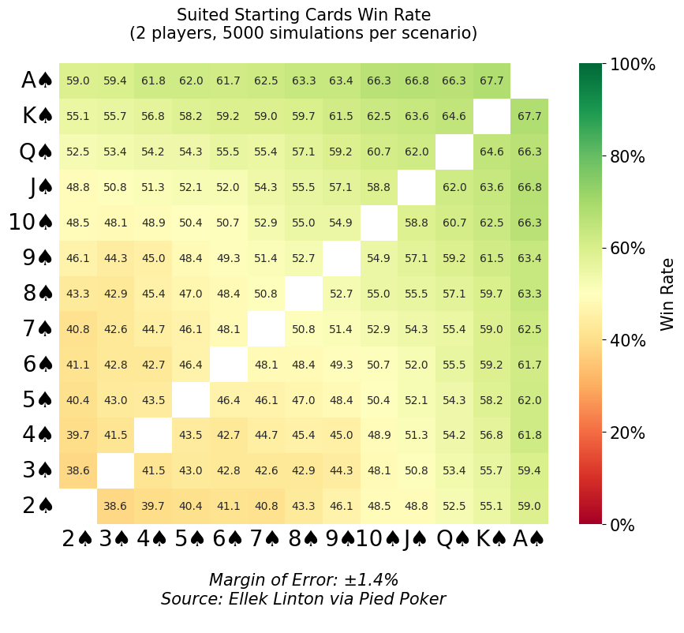
    


Of course, we can see that AK is the best possible suited starting pair! Interestingly, 7 2 is NOT the worst possible starting hand! Actually, 2 3 has the absolute lowest win probability of 38.6%, whereas 7 2 has a slightly higher win probability of 40.8%.

Cool! Now, let's calculate a similar chart for UNSUITED cards, which is only slightly different!


```python
n_players = 2
n_rounds = 5000
pp.Visualization.StartingCardProbabilities(suited=False).visualize(n_rounds, n_players)
```

    Calculating win probabilities (0.0% done)
    Calculating win probabilities (5.92% done)
    Calculating win probabilities (11.83% done)
    Calculating win probabilities (17.75% done)
    Calculating win probabilities (23.67% done)
    Calculating win probabilities (29.59% done)
    Calculating win probabilities (35.5% done)
    Calculating win probabilities (41.42% done)
    Calculating win probabilities (47.34% done)
    Calculating win probabilities (53.25% done)
    Calculating win probabilities (59.17% done)
    Calculating win probabilities (65.09% done)
    Calculating win probabilities (71.01% done)
    Calculating win probabilities (76.92% done)
    Calculating win probabilities (82.84% done)
    Calculating win probabilities (88.76% done)
    Calculating win probabilities (94.67% done)


    
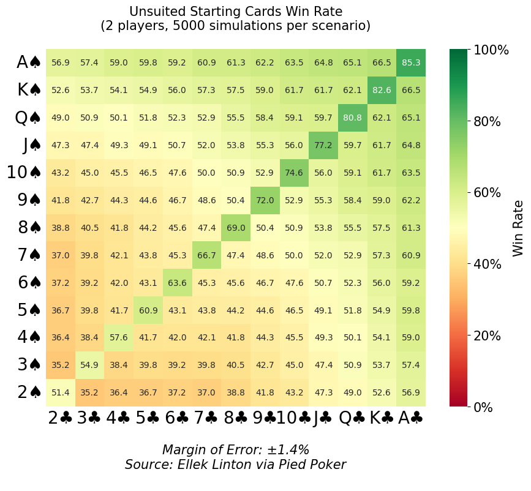
    


And of course, AA is the best unsuited starting hand, yielding an 85% chance of winning at a table of 2 players!

Notice that, between the suited and unsuited charts, suited cards only tend to generally have 2-3% better chance of winning, meaning they are not really much better than unsuited cards! It's more in your head than anything, because the probability that A) a flush is possible with the table cards, and B) the flush suit is the same as your suit, is around 2-3%.

Additionally, we can visualize the probability of winning with different pocket pairs, dependent on the number of players at the table. For example, AA is much more likely to win if there are only 2 players left in the game, vs a full 9 player table:


```python
min_players=2
max_players=9
n_rounds = 5000
pp.Visualization.PocketPairsVsNumPlayers().visualize(n_rounds=n_rounds, min_players=min_players, max_players=max_players)
```

    Calculating win probabilities for 2♠ 2♣ (0.0% done)
    Calculating win probabilities for 3♠ 3♣ (7.69% done)
    Calculating win probabilities for 4♠ 4♣ (15.38% done)
    Calculating win probabilities for 5♠ 5♣ (23.08% done)
    Calculating win probabilities for 6♠ 6♣ (30.77% done)
    Calculating win probabilities for 7♠ 7♣ (38.46% done)
    Calculating win probabilities for 8♠ 8♣ (46.15% done)
    Calculating win probabilities for 9♠ 9♣ (53.85% done)
    Calculating win probabilities for 10♠ 10♣ (61.54% done)
    Calculating win probabilities for J♠ J♣ (69.23% done)
    Calculating win probabilities for Q♠ Q♣ (76.92% done)
    Calculating win probabilities for K♠ K♣ (84.62% done)
    Calculating win probabilities for A♠ A♣ (92.31% done)


    
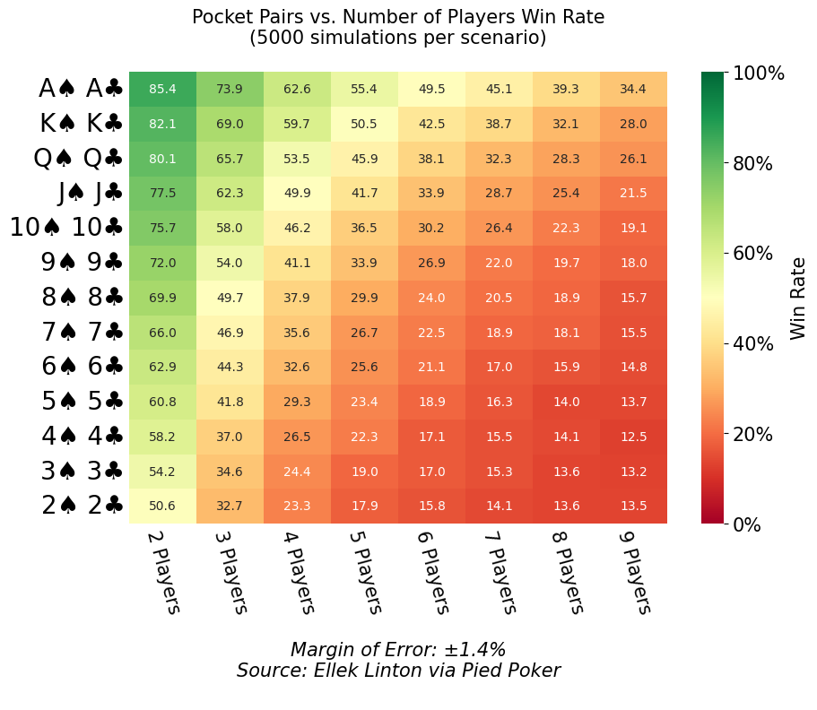
    


If you enjoyed this walkthrough, please "Star" the Github repo for this project, it helps make the project more visible: https://github.com/elleklinton/PiedPoker

Thanks for reading, and remember, you've got to [know when to hold 'em and when to fold 'em](https://www.youtube.com/watch?v=7hx4gdlfamo&t=70s)!!!
